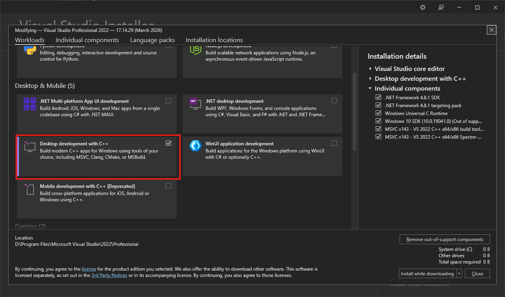
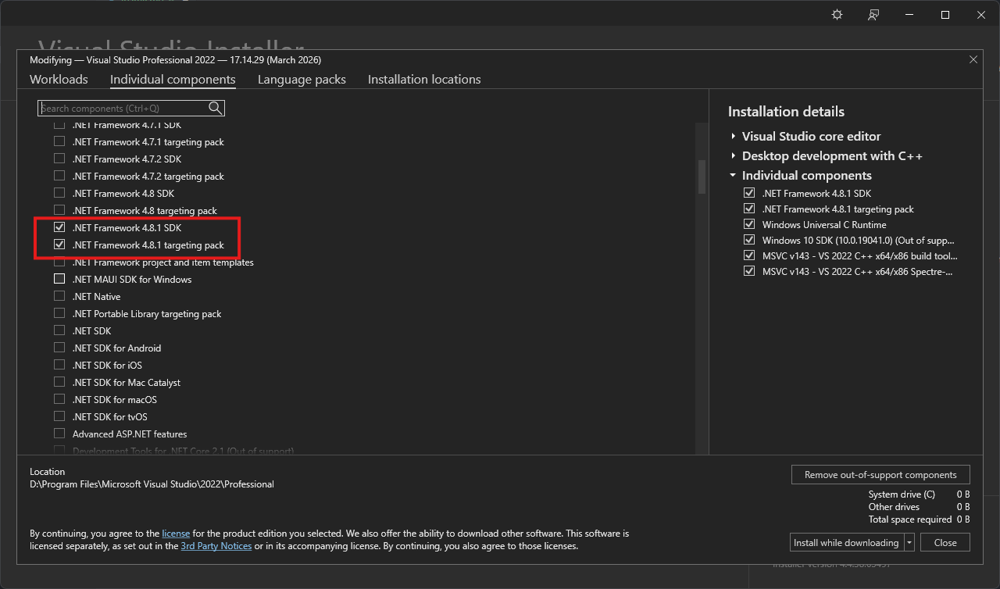

# 🛠️ Installation Guide: Visual Studio 2022 Components

This guide covers the necessary components required to build and run this project. Follow the steps below to ensure your development environment is correctly configured.

---

## 1. Install Visual Studio 2022
If you haven't installed it yet, you can download the installer here:
👉 [Download Visual Studio 2022 Professional](https://aka.ms/vs/17/release/vs_professional.exe)

---

## 2. Select Required Workloads
Open the **Visual Studio Installer**, click **Modify**, and ensure the following workloads are checked in the **Workloads** tab:

* **Desktop development with C++**: This is essential for building native applications and using the MSVC compiler.

---

## Optional: Detours Support
If you plan on building or compiling your own version of [Microsoft Detours](https://github.com/microsoft/detours), you will need the following component for key generation:

---

## 3. Individual Components (Optional)
For specific SDK requirements (such as Windows 10 or 11 SDKs), switch to the **Individual components** tab and verify the following are selected:

---

## 4. Finalize Installation
1. Click the **Modify** (or **Install**) button at the bottom right.
2. Wait for the process to complete.
3. **Restart Visual Studio 2022** once the installation is finished to ensure all paths are updated.
